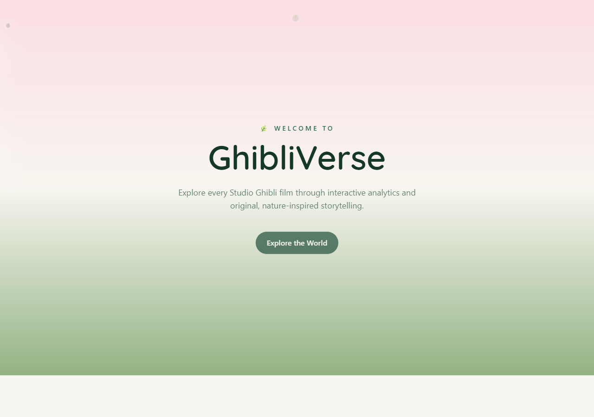
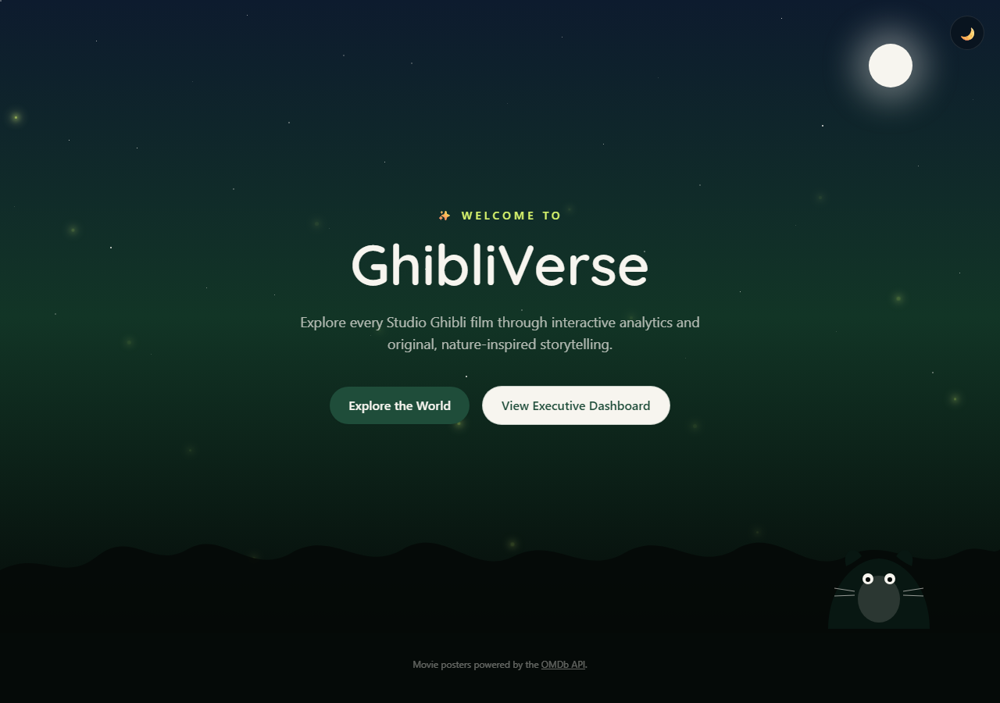
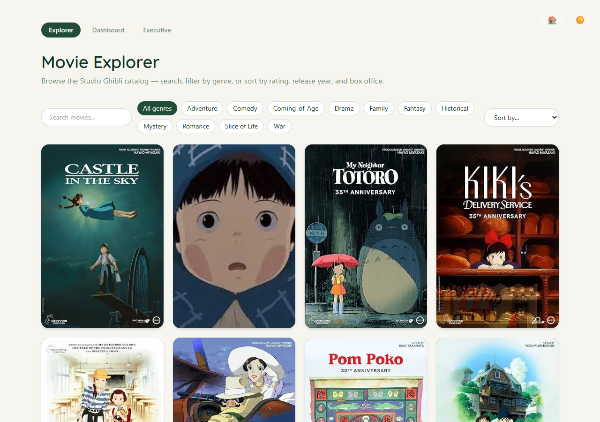
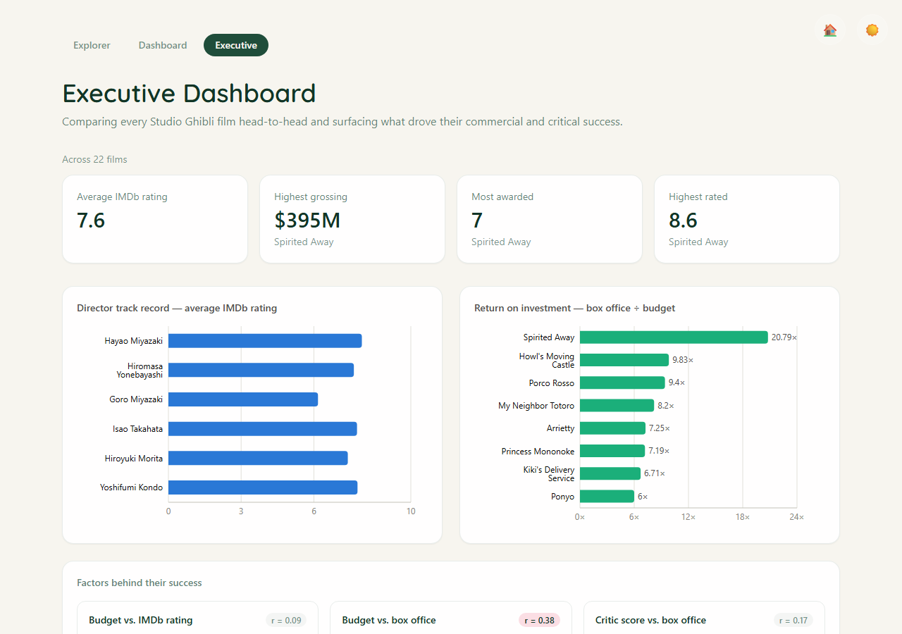

# 🌿 GhibliVerse

An AI-powered Studio Ghibli analytics platform — a portfolio project combining
business intelligence, data science, and immersive web storytelling.

This is the **foundation + first vertical slice**: Landing → Movie Explorer →
Analytics Dashboard → Executive Dashboard, wired end-to-end to a real seeded
dataset. See [Roadmap](#roadmap) for what's designed-for but not yet built.

## Screenshots

| Landing (Day in the Forest) | Landing (Moonlit Forest) |
|---|---|
|  |  |

| Movie Explorer | Executive Dashboard |
|---|---|
|  |  |

A day/night toggle (top-right, on every page) switches between **Day in the
Forest** — floating leaves, parallax clouds — and **Moonlit Forest** — fireflies,
stars, moon, tree-canopy silhouette. The choice persists across visits
(`localStorage`) and drives both the UI theme and the dashboard chart palette.

## Architecture

```
Next.js (Vercel)  ──HTTP──>  FastAPI (Render/Railway)  ──SQL──>  Supabase Postgres
     │                              │
     └── Framer Motion, Recharts    └── SQLAlchemy, Pydantic
```

- **Frontend** (`frontend/`) — Next.js 14 App Router, TypeScript, Tailwind CSS,
  Framer Motion for ambient/hover animation, Recharts for the dashboard.
- **Backend** (`backend/`) — FastAPI, SQLAlchemy 2.0, read-only REST API over
  movies + analytics aggregates.
- **Database** — Supabase (hosted Postgres). Schema + seed pipeline in `data/`.

Movie posters are fetched from the [OMDb API](https://www.omdbapi.com/)
(IMDb-sourced data, attributed in the site footer), falling back to an original
gradient placeholder if a poster isn't found. Everything else — the forest
palette, floating leaves, parallax clouds, fireflies, and the forest-spirit
silhouette on the landing page — is an original, nature-inspired aesthetic with
no copyrighted Ghibli character art.

## Tech stack

| Layer | Tools |
|---|---|
| Frontend | Next.js, TypeScript, Tailwind CSS, Framer Motion, Recharts |
| Backend | FastAPI, SQLAlchemy, Pydantic |
| Database | Supabase (Postgres) |
| Data | Pandas (cleaning), SQL |
| Testing | Vitest + React Testing Library, Pytest |

## Local setup

**1. Data — seed Supabase**
```bash
python -m venv .venv && .venv\Scripts\activate
pip install -r data/requirements.txt
cd data
python scripts/clean.py
# run sql/001_schema.sql in the Supabase SQL editor, then:
cp .env.example .env   # fill in SUPABASE_DB_URL
python scripts/seed_supabase.py
```

**2. Backend**
```bash
pip install -r backend/requirements.txt
cd backend
cp .env.example .env   # fill in SUPABASE_DB_URL
uvicorn app.main:app --reload   # http://localhost:8000
```

**3. Frontend**
```bash
cd frontend
npm install
cp .env.example .env.local   # NEXT_PUBLIC_API_URL=http://localhost:8000
npm run dev   # http://localhost:3000
```

See `backend/README.md` and `data/README.md` for more detail.

## Tests

```bash
cd backend && pytest              # runs against an in-memory SQLite fixture
cd frontend && npm run test       # Vitest + React Testing Library
```

Both run in CI on every push/PR (`.github/workflows/ci.yml`), alongside lint and
type checking.

## Deployment

- **Frontend** → Vercel (root: `frontend/`, env: `NEXT_PUBLIC_API_URL`)
- **Backend** → Render or Railway (root: `backend/`, env: `SUPABASE_DB_URL`,
  `FRONTEND_ORIGIN`)
- **Database** → Supabase (already hosted)

## Data attribution

Seeded from a static, hand-cleaned CSV of the Studio Ghibli theatrical catalog
(title, director, runtime, ratings, box office, budget, genres, awards). Box
office/budget/awards figures are approximate, compiled from public sources for
demonstration purposes — see `data/README.md`.

## Roadmap

This slice deliberately covers only Landing → Explorer → Dashboard. The
architecture is designed to grow into the fuller GhibliVerse vision without
rework:

- 🤖 AI Movie Assistant (RAG chat, using OpenAI or Gemini — both available)
- 🔍 Semantic search ("show me movies about healing")
- 💬 Review summarization & audience sentiment analysis
- 🎭 Character analytics (screen time, sentiment, relationship graphs)
- 🌎 Global popularity map & streaming availability
- 📅 Interactive release timeline
- 🎵 Music/composer analytics
- 🌿 Computer-vision "nature score" frame analysis
- 🎨 Color palette extraction per film
- ☁️ Original Ghibli-inspired scene generator
- 📄 PDF export, favorites, achievement badges

Each is architecturally possible today (the chart token system already supports
theming, the API is easy to extend, the data model has room to grow) but
intentionally not implemented yet.
